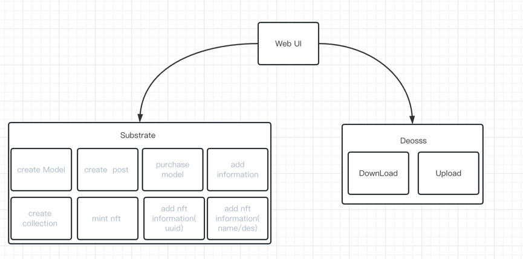
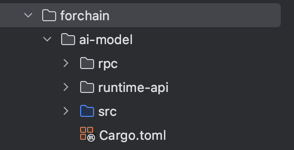
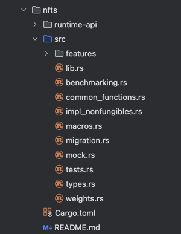
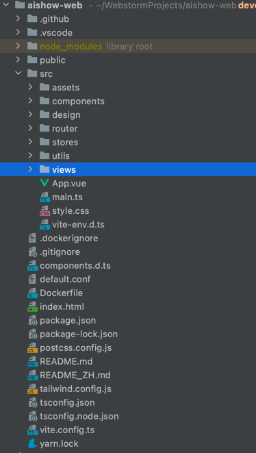

# 2023WXH-AIShow

## Basic Information

**Project Name:** AIShow 

**Project Initiation Date:** Sep 2023

## Project overview
* Background of the project 
  AIShow——Let everyone have a soulmate.
  Everyone wants a soulmate, but it's hard to find one in real life. However, with the popularity of ChatGPT, people are realizing the capabilities of AI and its extensive application scenarios. Plus, mature technologies like blockchain and digital identity make this possible. We will leverage AI, blockchain and more to give everyone a soulmate through large model training, evolvable digital identities and avatars, and other means. So a decentralized AI model sharing and creation platform - AIShow - emerges.
  
* Project introduction  
  AIShow is a decentralized AI model sharing and creation platform where everyone can generate their own treasured girl/boy.
  Due to factors like low TPS, hard to upgrade, and insufficient composability in blockchain, we decide to build AIShow with application chain for overall consideration.
  In AIShow, all data is stored in a distributed way, with privacy solutions introduced to protect user privacy. Users can publish their own AI models, create works based on models they like, and mint their creations into NFTs to circulate in the marketplace. Through large model training and evolvable NFT technologies, users can train the optimal companion model and give it an evolvable digital identity.
  Users are not only builders and users, but also beneficiaries. AIShow adopts incentive mechanisms and behavior mining. All behaviors that contribute to the platform, like publishing AI models, creating works, model training, likes and comments, will be rewarded.

* Project information 
    - [Online address](http://aishow.v6.navy/)
    - [PPT](https://docs.google.com/presentation/d/1GFCo-Pn0C5m_gfiYTYNfTn-T9ZE41wPM9FTX4UaMP2Q/edit?usp=sharing)
    - [Demo Video](https://youtu.be/Oau9pRBgMKo)

* Project Architecture 
   

* Project logo  

   
* The initial commitment of the project 
  Blockchain end: 59a21506a26229a52ffcc2d11d878c49ceedb992

* Source code address
    - blockchain end: https://github.com/mohaijiang/forchain-substrate.git
    - web end: https://github.com/mohaijiang/aishow-web.git

## Items planned to be completed

**blockchain end**
- `pallet-forchain`
    - [ ] create Model Information( `fn create_ai_model()` )
    - [ ] create a post under the model( `fn create_ai_image()` )
    - [ ] purchase model( `fn buy_model()` )

- `pallet-nfts`
    - [ ] create a collection (`fn create()`)
    - [ ] add information for collection (`fn set_collection_metadata()`)
    - [ ] mint nft (`fn mint()`)
    - [ ] add nft information(uuid) (`fn set_metadata`)
    - [ ] add nft information(name/des) (`fn set_attribute`)

**client**
- web end
    - [ ] Personal Information Interface
    - [ ] Model display interface
    - [ ] Post Details Screen
    - [ ] Nft Details Screen
    - [ ] Model Upload Page
    - [ ] Post upload interface
    - [ ] NFT Mint page
    - [ ] NFT transactions
    - [ ] Model Download
    - [ ] Nft download

## Items completed

**blockchain end**
- `pallet-forchain`
    - [ ] create Model Information( `fn create_ai_model()` )
    - [ ] create a post under the model( `fn create_ai_image()` )
    - [ ] purchase model( `fn buy_model()` )

- `pallet-nfts`
    - [ ] create a collection (`fn create()`)
    - [ ] add information for collection (`fn set_collection_metadata()`)
    - [ ] mint nft (`fn mint()`)
    - [ ] add nft information(uuid) (`fn set_metadata`)
    - [ ] add nft information(name/des) (`fn set_attribute`)

**client**
- web end
    - [ ] Personal Information Interface
    - [ ] Model display interface
    - [ ] Post Details Screen
    - [ ] Nft Details Screen
    - [ ] Model Upload Page
    - [ ] Post upload interface
    - [ ] NFT Mint page
    - [ ] NFT transactions
    - [ ] Model Download
    - [ ] Nft download

**code structure**

- blockchain end 

 

- web end 
  

## Team member information

| Name      | Role                    | GitHub  | WeChat account     |
|-----------|-------------------------|----------------| ----------- |
| LiangTeng | project leader          | ltmuyuan       | ltyuanmu   |
| TT        | product manager         | tdyy555        | ttyoung26   |
| Sun       | developer               | jian-guo-s     | SJG12_3   |
| Abing     | developer               | abing258       | wxid_5rtca6zdqsyn22   |
| Tom       | architecture&full stack | mohaijiang     | wxid_as0r69jy6rn712   |
